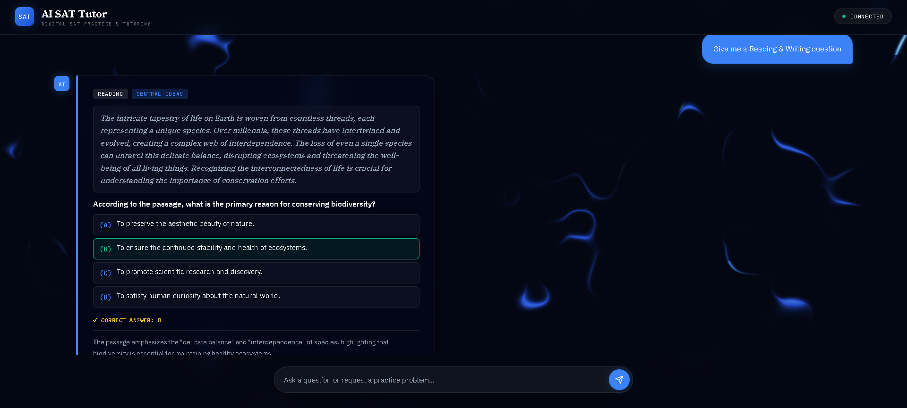

#  Self-Hosted AI SAT Assistant

A full-stack, API-free AI study assistant that answers questions from SAT study materials using **OCR**, **BM25 retrieval**, and a **self-hosted Gemma 2 (9B GGUF) Large Language Model**. The project is built entirely with open-source technologies and does not rely on commercial AI APIs such as OpenAI, Gemini, or Claude.


---





## Project Goal

The goal of this project was to build a private, self-hosted SAT assistant that can answer from my own study material without using paid AI APIs.

Instead of sending prompts to an external model provider, the app runs a quantized open-source model directly inside a Hugging Face Space and combines it with a lightweight custom RAG pipeline.


---

##  Features

-  OCR-based text extraction from scanned SAT notes
-  BM25 retrieval for context-aware question answering
-  Short-term conversational memory
-  Local Gemma 2 (9B GGUF) inference via llama.cpp
-  FastAPI backend deployed on Hugging Face Spaces
-  Real-time streaming AI responses
-  React + TypeScript frontend
-  100% API-free architecture
-  Programmatic math-question generation for fast practice prompts
- Docker-based Hugging Face Spaces deployment

---

## 🛠 Tech Stack

**Frontend**
- React
- TypeScript
- Vite

**Backend**
- FastAPI
- Python
- llama.cpp
- BM25
- OCR
- NumPy
- Gemma 2 9B GGUF

### Document Processing

- OCR from scanned SAT notes
- PDF/image-to-text preprocessing
- JSON corpus generation


---

**Deployment**
Hugging Face Spaces (Free CPU Tier)

---

## 🏗 System Architecture

```text
Scanned SAT Notes
        │
        ▼
 OCR Text Extraction
        │
        ▼
 BM25 Retrieval
        │
        ▼
 Gemma 2 (9B GGUF)
        │
        ▼
 FastAPI Backend
        │
        ▼
 React Frontend
```

---

##  How It Works

1. I uploaded my SAT NOTES IN pdf and converted to jpeg.
2. OCR extracts machine-readable text from the documents.
3. The extracted text is indexed using BM25.
4. Relevant context is retrieved based on the user's question.
5. The retrieved context is sent to a locally hosted Gemma 2 LLM.
6. Responses are streamed back to the React frontend in real time.

---

##  Deployment

Running a 9B parameter language model locally exhausted my laptop's RAM and CPU resources. To overcome this, I deployed the FastAPI backend and the quantized Gemma 2 model to **Hugging Face Spaces** using the **free CPU hosting tier (2 vCPUs)**.

This enabled the entire project to be built and deployed at **$0 cost** while remaining completely independent of commercial AI APIs.

> **Note:** Response generation is intentionally slower (~2–3 tokens/sec) because inference runs on Hugging Face's free CPU tier rather than GPU hardware, dropping to a smaller model (Gemma 2B) is the biggest realistic lever, and trimming unnecessary RAG context injection is a close second since it's literally free.

---

## Future Improvements

* Add frontend note upload
* Add persistent user accounts
* Add source citations for retrieved notes
* Improve mobile performance
* Add model switching between smaller and larger models
* Add quiz history and scoring
* Add flashcard generation
* Add hybrid retrieval with embeddings

